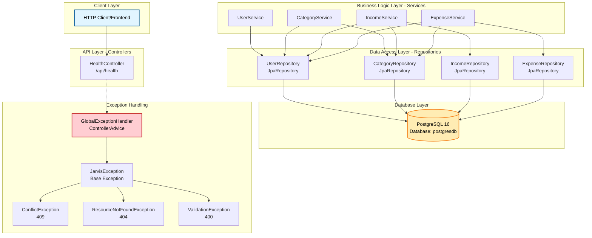
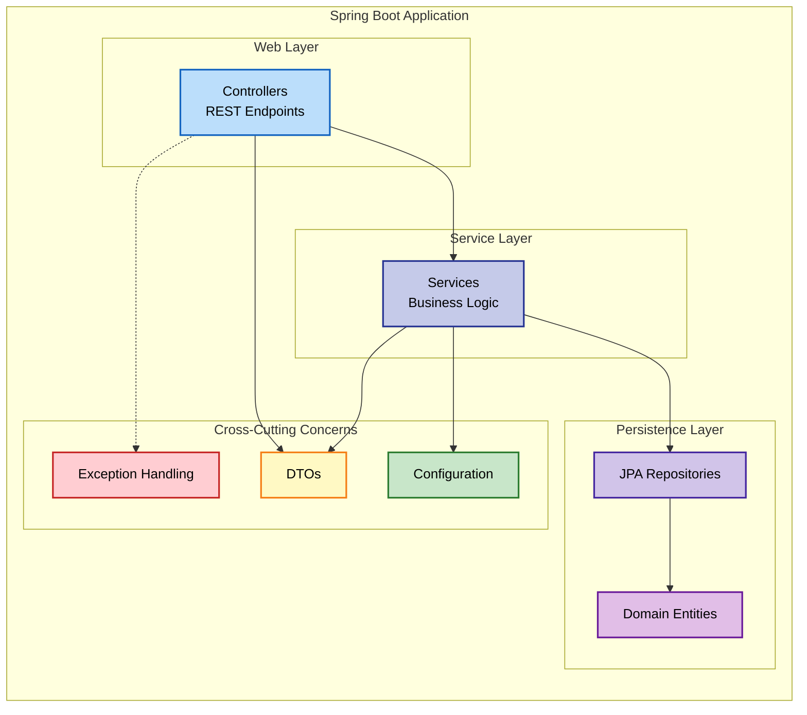
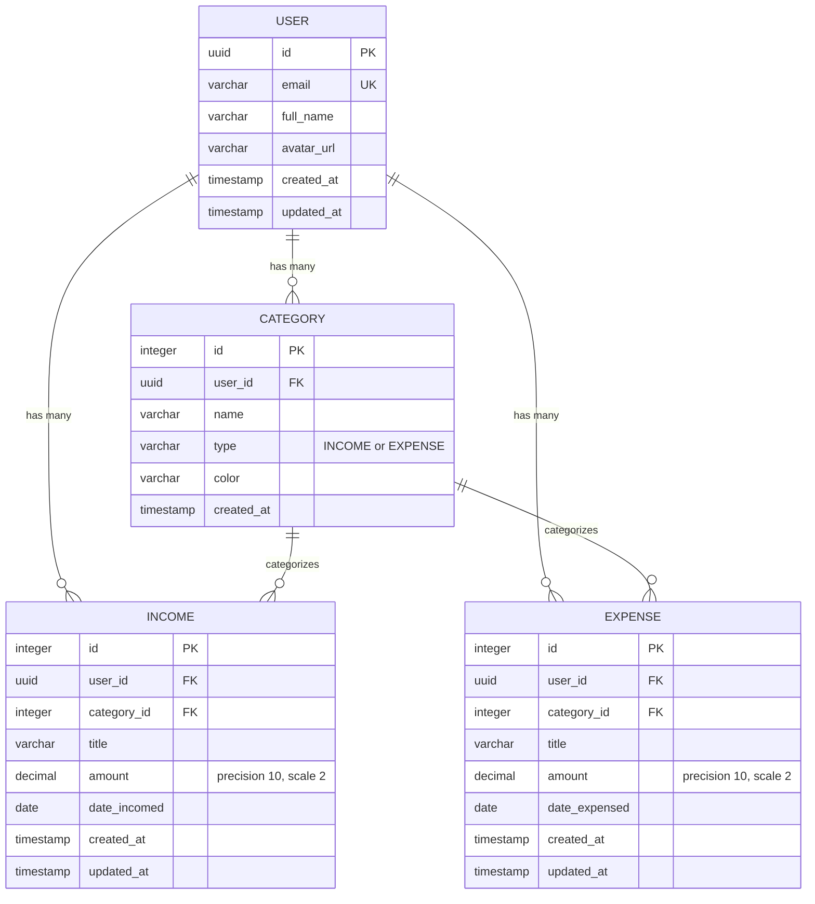
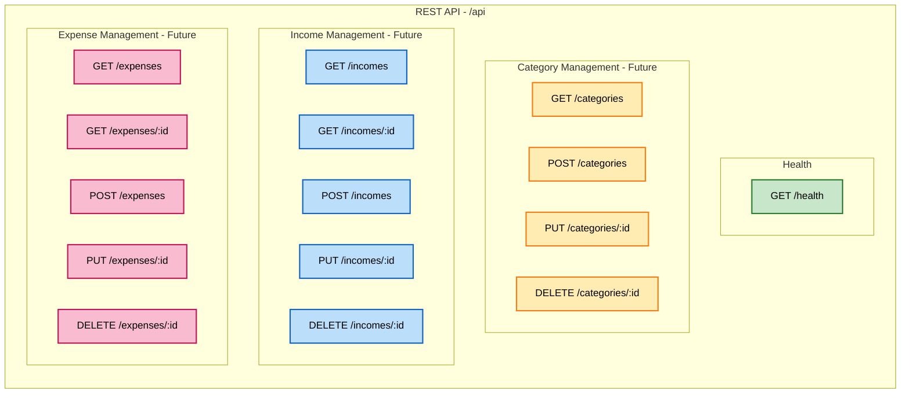
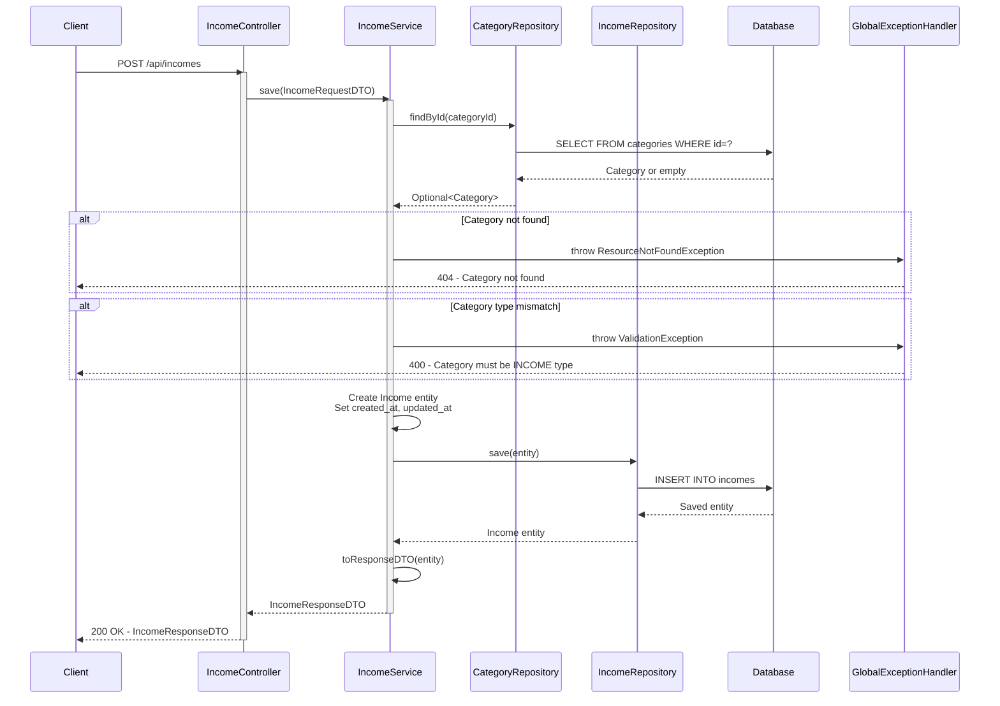
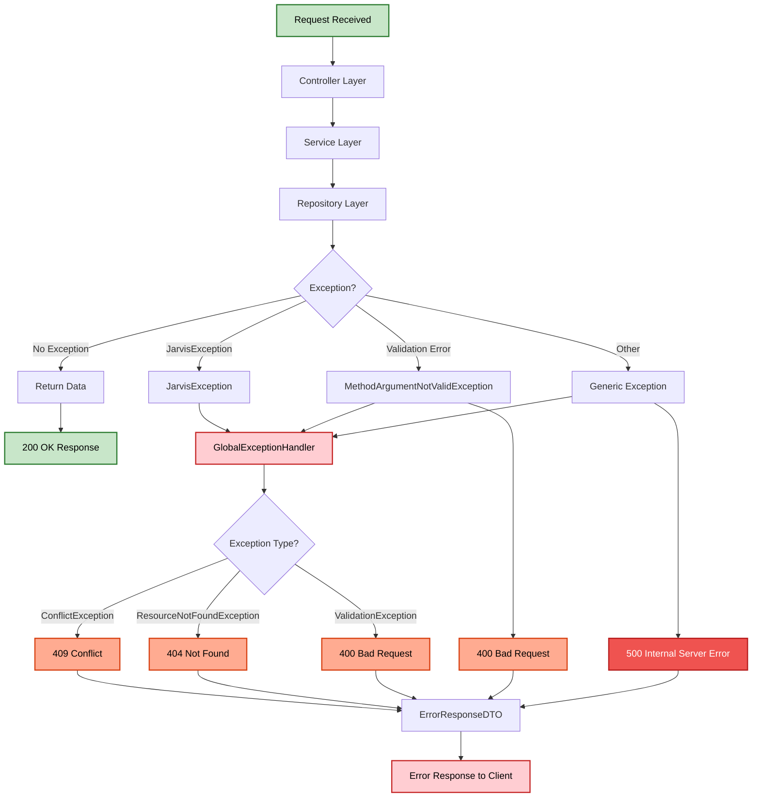
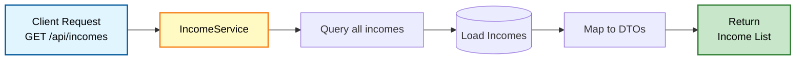
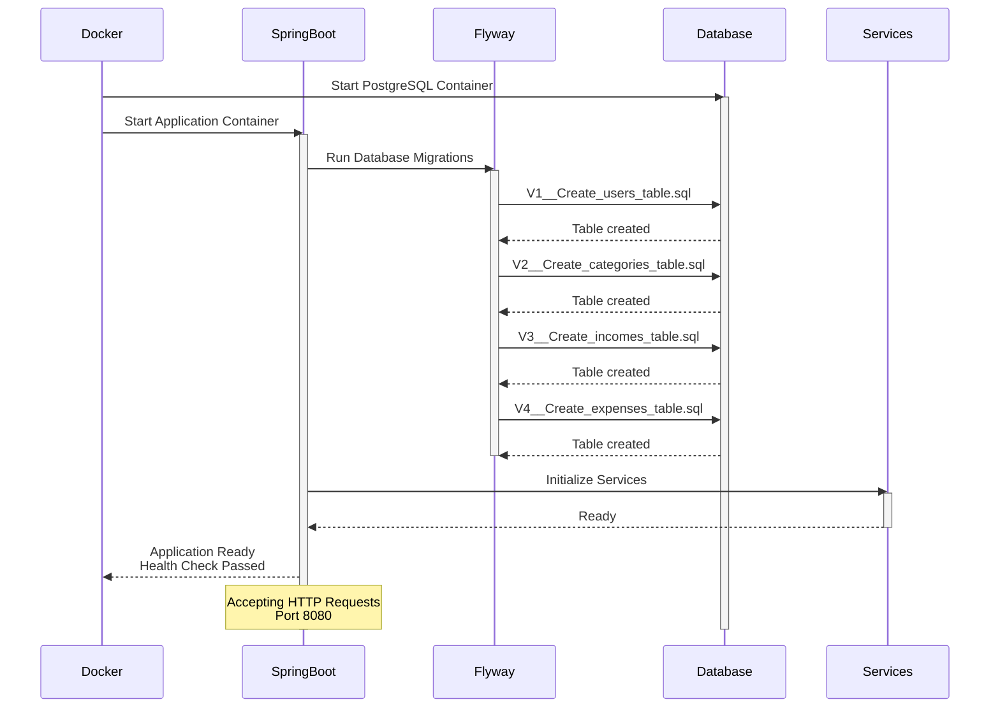
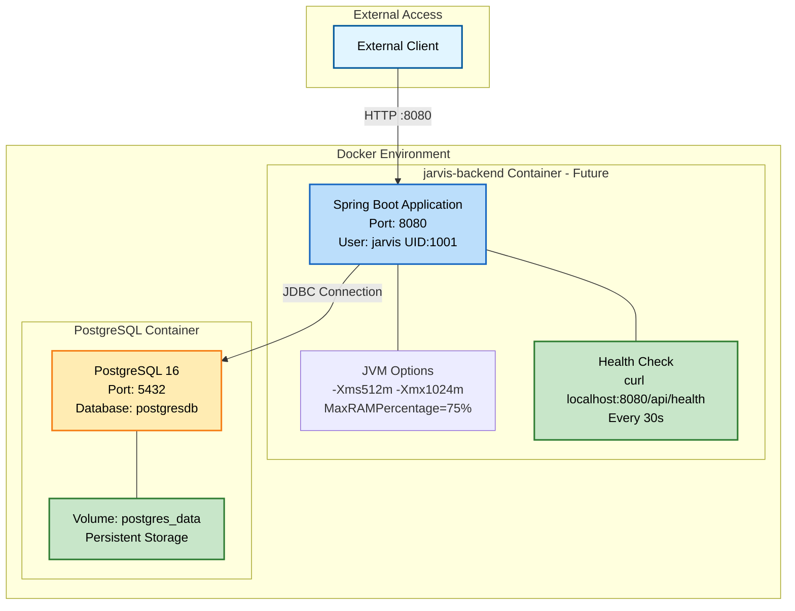
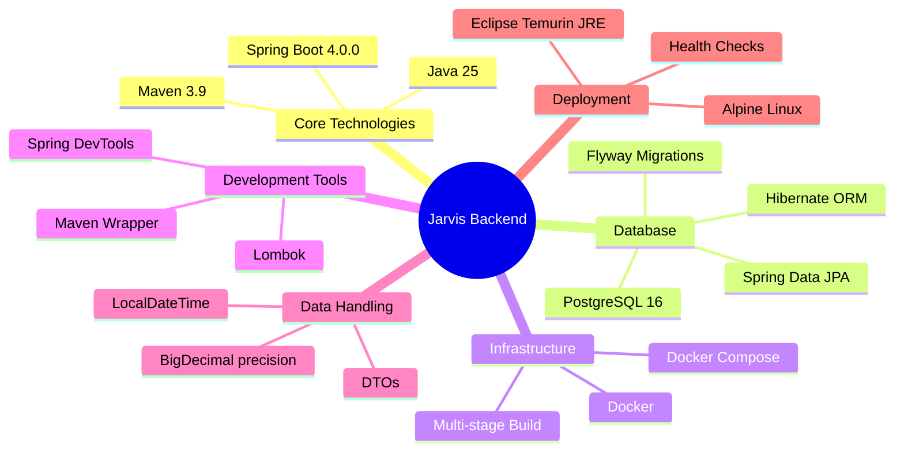

# Jarvis Backend - System Design

## High-Level Architecture

## Component Architecture

## Domain Model - Entity Relationships

## API Endpoints Overview

## Request Flow - Create Income

## Exception Handling Flow

## Data Flow - Income/Expense Queries

## Application Startup Flow

## Deployment Architecture

## Technology Stack

## Key Design Patterns

### 1. **Layered Architecture (MVC)**
- **Controller Layer**: REST endpoints, request handling
- **Service Layer**: Business logic, validation
- **Repository Layer**: Data access abstraction
- **Entity Layer**: Domain models

### 2. **DTO Pattern**
- Separation between API contracts and domain entities
- Request/Response DTOs for each resource
- Prevents over-fetching and security issues

### 3. **Repository Pattern**
- JPA repositories abstract database operations
- Custom query methods where needed
- Clean separation from business logic

### 4. **Exception Handling Strategy**
- Custom exception hierarchy extending base `JarvisException`
- Global exception handler with `@ControllerAdvice`
- Consistent error response format

### 5. **Dependency Injection**
- Spring's IoC container manages dependencies
- Constructor injection for services
- Loose coupling between components

### 6. **Transaction Management**
- Declarative transactions with `@Transactional`
- ACID compliance
- Read-only transactions for query operations

### 7. **Configuration Externalization**
- `@ConfigurationProperties` for structured config
- Environment variable overrides
- Sensible defaults

## Security Considerations

1. **Container Security**: Non-root user (jarvis, UID 1001)
2. **Database Isolation**: Service-to-service communication via Docker network
3. **Input Validation**: DTO validation annotations
4. **Exception Handling**: No sensitive data in error messages
5. **Monetary Precision**: BigDecimal prevents calculation errors

## Scalability Notes

1. **Stateless Services**: No session state in application
2. **Database Connection Pooling**: HikariCP default in Spring Boot
3. **Read-Only Transactions**: Optimized for query operations
4. **Containerization**: Easy horizontal scaling
5. **Health Checks**: Kubernetes/orchestration ready

## API Design Principles

1. **RESTful**: Standard HTTP methods (GET, POST, PUT, DELETE)
2. **Resource-Oriented**: Clear resource URLs (/api/transactions)
3. **Consistent Responses**: Standardized DTO formats
4. **Error Handling**: Meaningful HTTP status codes
5. **Filtering Support**: Query parameters for complex searches
6. **KISS Principle**: Simple, maintainable design
